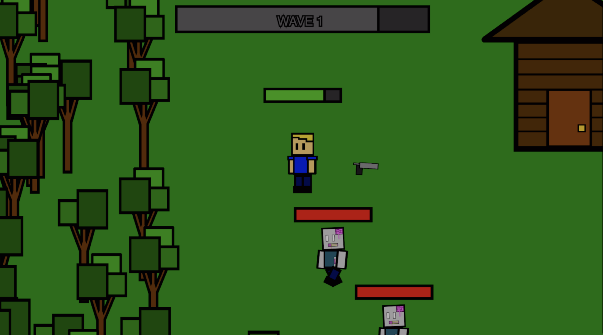

# README for Zombie Invasion Game Repository

## Introduction
Welcome to the repository for "Zombie Invasion," a web-based game designed using HTML, JavaScript, and the p5.js library. This game is a culmination of creative design, programming expertise, and collaborative effort. The repository contains all the necessary files, including the game's source code, assets, and a comprehensive final documentation report.

#you can try the game using this link: https://i6.cims.nyu.edu/~tmn8829/interactive/final/index.html

## Game Overview
Zombie Invasion is an interactive game set in a natural environment with a house in the middle. Players must survive waves of zombies, with the game's difficulty increasing with each wave. The game features a boss level, adding a climactic challenge to the experience.

### Key Features:
- Progressive Difficulty: The game becomes more challenging with each wave.
- Engaging Combat: Players use weapons and bullets to fight off zombies.
- Dynamic Environment: The game features a changing background, reflecting different times of day or environmental conditions.

## File Structure
- `index.html`: Main HTML file for the game.
- `sketch.js`: Primary JavaScript file containing game logic.
- `assets/`: Folder containing all game assets (images, animations).
- `report.pdf`: Detailed report on the game development process (Final Documentation - Zombie Invasion).

## Game Mechanics
- Player Mechanics: Includes player movement, health management, and interaction with weapons.
- Enemy Mechanics: Sophisticated AI for zombies, including wave progression and boss level dynamics.
- Environmental Interactions: Players can use the terrain for strategic advantages.

## Development and Contributions
- Initial Concept: Transitioned from a Minecraft-like game to "Zombie Invasion" for a more comprehensive and innovative project.
- Contributions: Significant assistance from a classmate, Pavly, and artistic assets from Copilot Git Hub.

## Challenges and Learning Experiences
- Programming Mechanics: Implementing player movement, shooting mechanics, and zombie AI.
- Animation and Graphics: Creating fluid animations for characters and environment.
- Debugging and Optimization: Ensuring smooth gameplay without technical issues.

## Future Aspirations
- Expanded Storyline and Characters: Introducing a deeper narrative and diverse enemies.
- Additional Game Modes: Including survival and time-limited challenges.
- Player Progression: Adding skill trees or upgrade systems.
- Social Features: Incorporating leaderboards or multiplayer options.

## Conclusion
This project was a comprehensive journey in game development, blending technical skills with creative storytelling and strategic planning. It stands as a testament to our dedication to creating immersive and engaging gaming experiences.

## How to Play
To play the game, simply clone this repository and open `index.html` in a web browser.

## Report
For an in-depth look at the development process, challenges faced, and reflections on the project, please refer to the attached `report.pdf` file.

---
Thank you for visiting the "Zombie Invasion" game repository. Enjoy the game and feel free to contribute or provide feedback!
